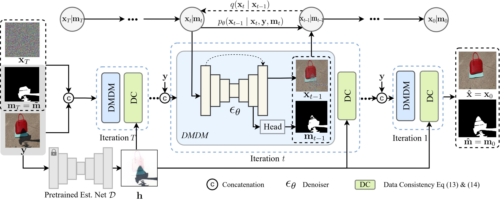

# [CVPR 2023] ShadowDiffusion: When Degradation Prior Meets Diffusion Model for Shadow Removal
### [Paper](https://arxiv.org/pdf/2212.04711.pdf)

**ShadowDiffusion: When Degradation Prior Meets Diffusion Model for Shadow Removal**
<br>_Lanqing Guo, Chong Wang, Wenhan Yang, Siyu Huang, Yufei Wang, Hanspeter Pfister, Bihan Wen_<br>
In CVPR'2023


#### News
* **Aug 08, 2023**: Release the pretrained model for SRD and evaluation results.
* **Aug 05, 2023**: Release the training and testing codes.

## Introduction
Our work addresses shadow removal by proposing a unified diffusion framework, dubbed ShadowDiffusion, that integrates both the image and degradation priors for highly effective shadow removal. ShadowDiffusion progressively refines the estimated shadow mask as an auxiliary task of the diffusion generator, which leads to more accurate and robust shadow-free image generation. For more details, please refer to our [original paper](https://arxiv.org/pdf/2212.04711.pdf).

<p align=center></p>

## Requirement
* Python 3.7
* Pytorch 1.7
* CUDA 11.1
```bash
pip install -r requirements.txt
```

## Datasets
* ISTD [[link]](https://github.com/DeepInsight-PCALab/ST-CGAN)  
* ISTD+ [[link]](https://github.com/cvlab-stonybrook/SID)
* SRD [[Training]](https://drive.google.com/file/d/1W8vBRJYDG9imMgr9I2XaA13tlFIEHOjS/view)[[Testing]](https://drive.google.com/file/d/1GTi4BmQ0SJ7diDMmf-b7x2VismmXtfTo/view)
[[Mask]](https://uofmacau-my.sharepoint.com/personal/yb87432_umac_mo/_layouts/15/onedrive.aspx?id=%2Fpersonal%2Fyb87432%5Fumac%5Fmo%2FDocuments%2Fghost%2Dfree%2Dshadow%2Dremoval%2Fsrd%5Fmask%2Ezip&parent=%2Fpersonal%2Fyb87432%5Fumac%5Fmo%2FDocuments%2Fghost%2Dfree%2Dshadow%2Dremoval&ga=1)
 (detected by [DHAN](https://github.com/vinthony/ghost-free-shadow-removal))
## Pretrained models
 [SRD](https://drive.google.com/drive/folders/1ZySQATCFjgRKE8a95gGyGYbhTaIgD8O7?usp=sharing) | [ISTD]() 

Please download the corresponding pretrained model and modify the `resume_state` in `shadow.json`.


## Test
You can directly test the performance of the pre-trained model as follows
1. Modify the paths to dataset and pre-trained model. You need to modify the following path in the `shadow.json` 
```python
resume_state # pretrain model or training state -- Line 12
dataroot # validation dataset path -- Line 30
```
2. Test the model
```python
python sr.py -p val -c config/shadow.json
```
We use the DDIM sampling to speed up the inference stage. The number of steps can be set as 5 or 25.
```python
skip = self.num_timesteps // 5
# skip = self.num_timesteps // 25
```

## Train
1. Download datasets and set the following structure
```
|-- SRD_Dataset
    |-- train
        |-- train_A # shadow image
        |-- train_B # shadow mask
        |-- train_C # shadow-free GT
    |-- test
        |-- test_A # shadow image
        |-- test_B # shadow mask
        |-- test_C # shadow-free GT
```
2. You need to modify the following terms in `option.py`
```python
"resume_state": null # if train from scratch
"dataroot"   # training and testing set path
"gpu_ids": [0] # Our model can be trained using a single RTX A5000 GPU. You can also train the model using multiple GPUs by adding more GPU ids in it.
```
3. Train the network
```python
python sr.py -p train -c config/shadow.json
```
## Evaluation
The results reported in the paper are calculated by the `matlab` script used in [previous method](https://github.com/zhuyr97/AAAI2022_Unfolding_Network_Shadow_Removal/tree/master/codes). Details refer to `evaluation/measure_shadow.m`.

#### Testing results
The testing results on dataset ISTD, ISTD+, SRD are: [results](https://drive.google.com/file/d/1IbA8TKIpAsxk9Vb1QHe1oIR0X-qC_gMN/view?usp=sharing)

## References
Our implementation is based on [SR3](https://github.com/Janspiry/Image-Super-Resolution-via-Iterative-Refinement) and [WeatherDiffusion](https://github.com/IGITUGraz/WeatherDiffusion). We would like to thank them.

Citation
-----
Preprint available [here](https://arxiv.org/pdf/2212.04711.pdf). 

In case of use, please cite our publication:

L. Guo, C. Wang, W. Yang, S. Huang, Y. Wang, P. Hanspeter, and B. Wen, "Shadowdiffusion: When degradation prior meets diffusion model for shadow removal," CVPR 2023.

Bibtex:
```
@inproceedings{guo2023shadowdiffusion,
  title={Shadowdiffusion: When degradation prior meets diffusion model for shadow removal},
  author={Guo, Lanqing and Wang, Chong and Yang, Wenhan and Huang, Siyu and Wang, Yufei and Pfister, Hanspeter and Wen, Bihan},
  booktitle={Proceedings of the IEEE/CVF Conference on Computer Vision and Pattern Recognition},
  pages={14049--14058},
  year={2023}
}
```

## Contact
If you have any questions, please contact lanqing001@e.ntu.edu.sg 
